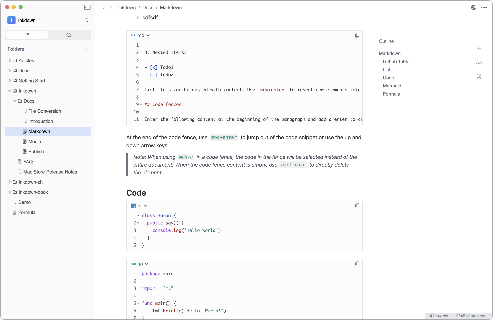
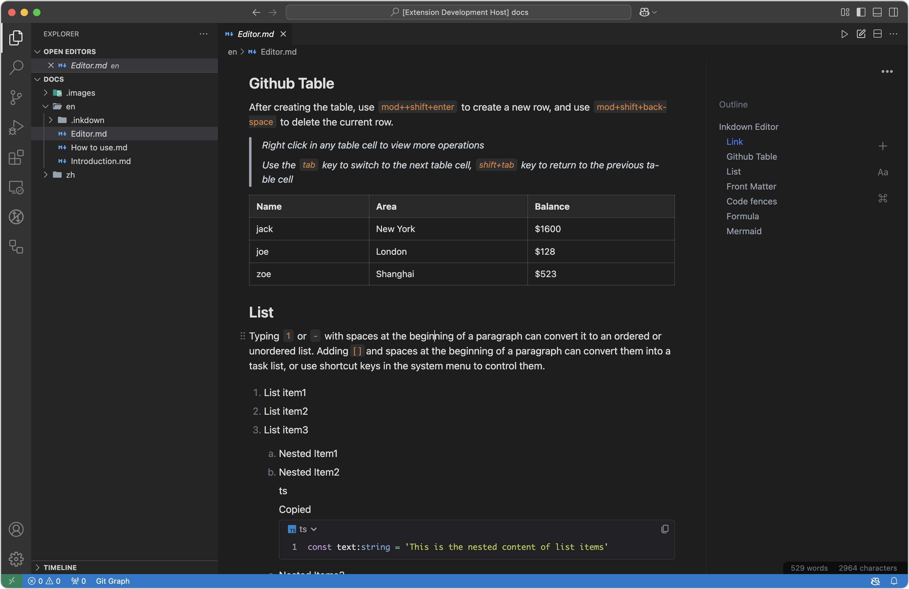
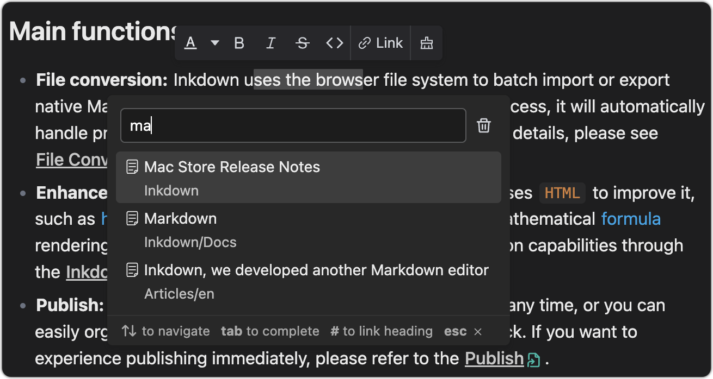
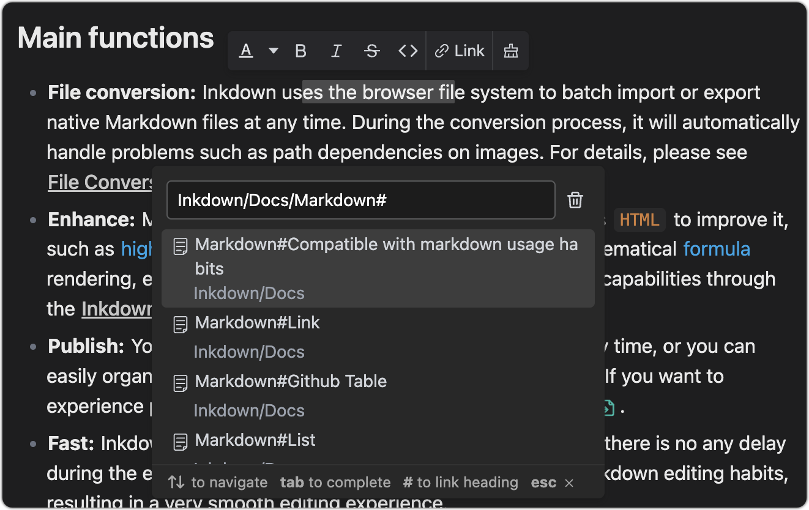
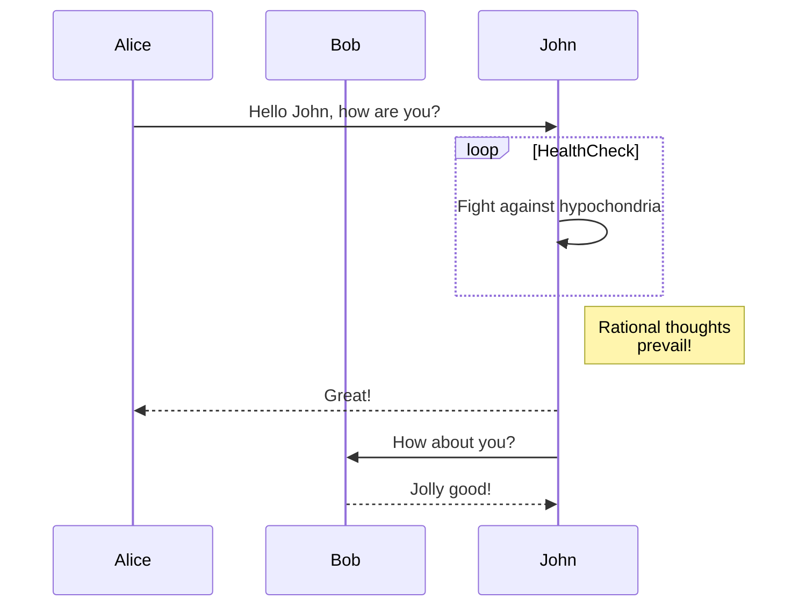

# Inkdown Editor

Inkdown is a WYSIWYG editor for Markdown, aimed at improving the editing and reading experience of Markdown. As a universal format, Markdown is very suitable for storing personal data, but the excessive number of symbols makes it not good at recording long texts. Inkdown aims to maintain a modern editor experience, compatibility with Markdown, and provide the simplest and most efficient document sharing capabilities.

| VsCode                                                                         | Mac                                                                                                                                                                                 | Windows                                                                                                                                                                               | Linux                                                          |
| ------------------------------------------------------------------------------ | ----------------------------------------------------------------------------------------------------------------------------------------------------------------------------------- | ------------------------------------------------------------------------------------------------------------------------------------------------------------------------------------- | -------------------------------------------------------------- |
| [Market](https://marketplace.visualstudio.com/items?itemName=1943time.inkdown) | [Arm64](https://github.com/1943time/inkdown/releases/latest/download/Inkdown-mac-arm64.dmg) [X64](https://github.com/1943time/inkdown/releases/latest/download/Inkdown-mac-x64.dmg) | [Arm64](https://github.com/1943time/inkdown/releases/latest/download/Inkdown-win-arm64.exe)   [X64](https://github.com/1943time/inkdown/releases/latest/download/Inkdown-win-x64.exe) | [Release](https://github.com/1943time/inkdown/releases/latest) |

Desktop



VsCode



## Link

You can use the link options in the floating bar to add links to text, which can be other markdown files in the space or protocol addresses such as HTTP. As shown in the following figure:

> Inkdown uses relative paths to save file links in the source markdown file.



You can also use tabs to complete the file path and add `#` to link to the anchor point of the markdown file



## Github Table

After creating the table, use `mod++shift+enter` to create a new row, and use `mod+shift+backspace` to delete the current row.

> Right click in any table cell to view more operations
> 
> Use the `tab` key to switch to the next table cell, `shift+tab` key to return to the previous table cell

| Name | Area     | Balance |
| ---- | -------- | ------- |
| jack | New York | $1600   |
| joe  | London   | $128    |
| zoe  | Shanghai | $523    |

## List

Typing `1` or `-` with spaces at the beginning of a paragraph can convert it to an ordered or unordered list. Adding`[ ]`and spaces at the beginning of a paragraph can convert them into a task list, or use shortcut keys in the system menu to control them.

1. List item1
2. List item2
3. List item3

   1. Nested Item1
   2. Nested Item2

      ts

      Copied

      ```ts
      const text:string = 'This is the nested content of list items'
      ```

   3. Nested Items3


- Todo1
- Todo2

List items can be nested with content. Use `mod+enter` to insert new elements into list items, and use tab or `shift+tab` to indent or undo the list.

## Front Matter

Enter the `---` symbol at the beginning of the document and press Enter to insert the `Front matter` element. Inkdown will only display the Front matter without any special processing.

## Code fences

Enter the following content at the beginning of the paragraph and add a enter to create a code fence

````
```[language]
````

At the end of the code fence, use `mod+enter` to jump out of the code snippet or use the up and down arrow keys.

> Note: When using `mod+a` in a code fence, the code in the fence will be selected instead of the entire document. When the code fence content is empty, use `backspace` to directly delete the element.

```ts
class Human {
	public say() { 
    console.log('hello world')
	}
}
```

```go
package main

import "fmt"

func main() {
    fmt.Println("Hello, World!")
}
```

```swift
import Cocoa
struct MarksStruct {
    var mark: Int
    init(mark: Int) {
      self.mark = mark
    }
}
var aStruct = MarksStruct(mark: 98)
print(aStruct.mark)
```

## Formula

Type`$$`at the beginning of the pfaragraph to create a block level formula editing area, where the formula will automatically render below. When the cursor leaves the editing area, it will be automatically folded. The rendering effect is as follows:

$$
\int_{-\infty}^{+\infty} e^{-x^2} dx = \sqrt{\pi}
$$

In line formula:$\int_{-\infty}^{+\infty} e^{-x^2} dx = \sqrt{\pi}$

## Mermaid

Mermaid is a tool that uses syntax to render graphics. When you create a code fence for the Mermaid language, the Mermaid graphics will be automatically rendered below the code snippet for [more details](https://mermaid.js.org/).

When the cursor leaves the input area, the code fence will be automatically collapsed, and the rendering effect is as follows:

