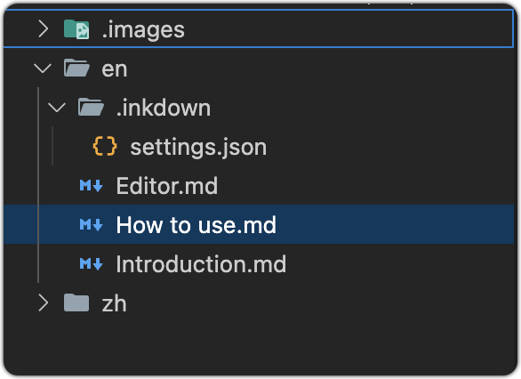

# How to use

## Deploy

Inkdown Book is built using Nodejs and Remix framework, so a Nodejs program needs to be deployed. If you use `Docker`, the deployment process will be very simple. Just execute the following command:

```sh
curl -fsSL https://github.com/1943time/inkdown-book/releases/latest/download/install.sh | bash
cd inkdown-book
docker build -t inkdown-book-image .
docker run -d --name inkdown-book -p 3000:3000 inkdown-book-image
```

After the container runs, we will expose port `3000`. Now we are using Nginx to proxy the domain name to port `3000`. The configuration is as follows:

```nginx
server {
    listen      80;
    client_max_body_size 10m;
    # listen      443 ssl;
    # ssl_certificate path.pem;
    # ssl_certificate_key path.key;
    # ssl_session_timeout 5m;
    # ssl_ciphers ECDHE-RSA-AES128-GCM-SHA256:ECDHE:ECDH:AES:HIGH:!NULL:!aNULL:!MD5:!ADH:!RC4;
    # ssl_protocols TLSv1 TLSv1.1 TLSv1.2;
    # ssl_prefer_server_ciphers on;
    server_name  docs.inkdown.cn;
    add_header 'Access-Control-Allow-Origin' '*';
    add_header 'Access-Control-Allow-Methods' 'GET, POST, PUT, DELETE, OPTIONS';
    add_header 'Access-Control-Allow-Headers' 'Content-Type, Authorization';
    gzip on;
    gzip_comp_level 6;
    gzip_min_length 1k;
    gzip_static on;
    gzip_types
    application/javascript
    text/javascript
    text/css
    application/json
    application/manifest+json
    image/svg+xml;
    location / {
        proxy_set_header X-Real-IP $remote_addr;
        proxy_set_header X-Forwarded-For $proxy_add_x_forwarded_for;
        proxy_set_header Host  $http_host;
        proxy_set_header X-Nginx-Proxy true;
        proxy_http_version 1.1;
        proxy_pass    http://localhost:3000;
    }
}
```

The service program has been deployed and we can now share any Markdown folder. If you do not wish to deploy using `Docker`, you can manually install the [Node.js runtime environment](#manually-install-nodejs-runtime-environment).

## Visual Studio Code

Inkdown Book currently supports two ways of sharing documents, using Vscode extension, Inkdown Editor。 Let's take Vscode extension as an example first.

Inkdown's Vscode extension is a Markdown WYSIWYG editor that also supports deploying Markdown documents to Inkdown Books. They are not interdependent, and if you only want to use a WYSIWYG editor or share documents, you can use this extension.

Search for Inkdown in the plugin market, use `mod+,` open the configuration panel, and search for inkdown.


Three parameters need to be filled in:

- `Host` Point to the domain name of the Inkdown Book service in the server-side configuration of Nginx.
- `KEY ID` After starting the container, the Inkdown program will generate an. env file in the program directory.
- `KEY Secret` After starting the container, the Inkdown program will generate an. env file in the program directory.

Enter the container to view the ID and secret.

```sh
docker exec -it inkdown-book bash
cat .env
```

Copy the ID and secret parameters to the VSCode configuration.

Each shared folder requires a configuration file, and its directory is `shared folder` ->`. inkdown` -> `settings. json`.

Now we can create the configuration file in the document folder, or right-click on the folder that needs to be published and select the `Publish to inkdown book`, which will ask if the configuration file is automatically created.



The content of the configuration file is as follows:

```json
{
  "name": "Inkdown Book",
  "id": "zh",
  "docs": [
    {
      "name": "Introduction",
      "path": "Introduction.md"
    },
    {
      "name": "How to use",
      "path": "How to use.md"
    },
    {
      "name": "Editor",
      "path": "Editor.md"
    },
    {
      "name": "More..."，
      children: [
        // ...
      ]
    }
  ],
  "nav": [
    {"text": "Vs Code", "link": "https://marketplace.visualstudio.com/items?itemName=1943time.inkdown"},
    {"text": "Inkdown Editor", "link": "https://github.com/1943time/inkdown"},
    {"text": "GitHub", "link": "https://github.com/1943time/inkdown-book"},
    {
      {
        "text": "Group", 
        "items": [
          {"text": "Abc", "link": ""},
          {"text": "Abc", "link": ""}
        ]
      }
    }
  ]
}
```

- `id` is globally unique (required) and also the access path in the URL. It must be noted that if the IDs are the same, the document content with conflicting IDs will be overwritten when synchronizing content.
- `name` Is the document name (required)
- `docs` is a custom document directory structure. If this field is not filled in, all documents in the folder will be synchronized and sorted by name. The children field can be used for directory nesting. Path is the file path relative to the publishing folder.
- `nav` can add external links and use the items field to add link directories.

The above are the configuration fields currently supported by Inkdown Book. Now let's share them on the network. Right click on the `en` folder and select Publish to Inkdown Book. Wait a moment to view the document.

## Resource processing

When synchronizing documents, Inkdown will automatically upload the image files that the document depends on, and images that have already been uploaded will not be uploaded again.

Linking to other Markdown files using a file path will be converted to a network link, for example:  `./ Start.md`, you can also use the `#` sign to add anchor points

## Delete

In the Vscode extension, using the `mod+shift+p` search command `Open Inkdown management page` can open and log in to the Inkdown Book management page. You can delete published folders in the management page.

You can also directly open the bound `domain name/inkdown-login` and log in using keyId and keySecret.

After deleting a published folder, its dependent image files will also be automatically deleted from the server.

## Manually install Nodejs runtime environment

If you do not want to deploy using Docker, you can also manually install the Nodejs runtime environment. The process is as follows:

The deployment program does not support Linux versions that are too low. Choose from the following versions.

- `centos` 8+
- `ubuntu` 20+
- `debian` 10+

```sh
curl -fsSL https://github.com/1943time/inkdown-book/releases/latest/download/install.sh | bash
cd inkdown-book
apt install unzip
curl -fsSL https://fnm.vercel.app/install | bash
source $HOME/.bashrc
fnm install 20
corepack enable
pnpm i
pnpm i pm2 -g
pm2 start ecosystem.config.cjs
```

By default, port `3000` is started, and after the program starts, nginx can be used to proxy the domain name to the shared program.