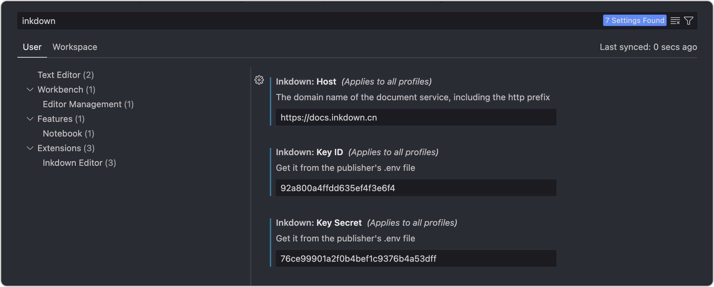

# 使用方法

## 部署

Inkdown Book使用Nodejs与Remix框架构建，所以需要部署一段Nodejs程序。如果您使用`Docker`，部署过程将十分简单。只需执行以下命令：

```sh
curl -fsSL https://github.com/1943time/inkdown-book/releases/latest/download/install.sh | bash
cd inkdown-book
docker build -t inkdown-book-image .
docker run -d --name inkdown-book -p 3006:3000 inkdown-book-image
```

容器运行后我们将暴露3006端口，现在使用Nginx将域名代理至3006端口，配置如下：

```nginx
server {
    listen      80;
    # listen      443 ssl;
    # ssl_certificate path.pem;
    # ssl_certificate_key path.key;
    # ssl_session_timeout 5m;
    # ssl_ciphers ECDHE-RSA-AES128-GCM-SHA256:ECDHE:ECDH:AES:HIGH:!NULL:!aNULL:!MD5:!ADH:!RC4;
    # ssl_protocols TLSv1 TLSv1.1 TLSv1.2;
    # ssl_prefer_server_ciphers on;
    server_name  docs.inkdown.cn;
    gzip on;
    gzip_comp_level 6;
    gzip_min_length 1k;
    gzip_static on;
    gzip_types
    application/javascript
    text/javascript
    text/css
    application/json
    application/manifest+json
    image/svg+xml;
    location / {
        proxy_set_header X-Real-IP $remote_addr;
        proxy_set_header X-Forwarded-For $proxy_add_x_forwarded_for;
        proxy_set_header Host  $http_host;
        proxy_set_header X-Nginx-Proxy true;
        proxy_http_version 1.1;
        proxy_pass    http://localhost:3006;
    }
}
```

服务程序已部署完成，现在我们可以共享任意Markdown文件夹了。如果您不希望使用`Docker`部署，可手动安装nodejs运行环境。

## Visual Studio Code

Inkdown Book目前支持3种共享文档方式，使用Vscode扩展，Inkdown Editor, 和Cli。我们先以Vscode扩展为例。

Inkdown的Vscode扩展是一个Markdown所见即所得编辑器，同时也支持将Markdown文档部署至Inkdown Book。他们之间并不互相依赖，如果您仅希望使用所见即所得编辑器或者仅共享文档都可以使用该扩展。

在插件市场中搜索Inkdown


安装后使用`mod+,`打开配置面板，搜索inkdown。



需要填写3个参数：

- `Host` 指向Inkdown Book服务的域名，在Nginx配置的server_name中。
- `KEY ID` 当启动容器后，Inkdown程序会在程序目录的.env文件中生成
- `KEY Secret` 当启动容器后，Inkdown程序会在程序目录的.env文件中生成。

进入容器查看 id 与 secret。

```sh
docker exec -it inkdown-book bash
cat .env
```

将id和secret参数复制到vscode配置中。

每个共享文件夹需要一个配置文件，他的目录是 `共享文件夹`-> `.inkdown`-> `settings.json`

现在我们在文档文件夹中创建该配置文件

> 图片

配置文件内容如下：

```json
{
  "name": "Inkdown Book",
  "id": "zh",
  "docs": [
    {
      "name": "简介",
      "path": "简介.md"
    },
    {
      "name": "使用方法",
      "path": "使用方法.md"
    },
    {
      "name": "编辑器",
      "path": "编辑器.md"
    },
    {
      "name": "更多..."，
      children: [
        // ...
      ]
    }
  ],
  "nav": [
    {"text": "Vs Code", "link": "https://marketplace.visualstudio.com/items?itemName=1943time.inkdown"},
    {"text": "Inkdown Editor", "link": "https://github.com/1943time/inkdown"},
    {"text": "GitHub", "link": "https://github.com/1943time/inkdown-book"},
    {
      {
        "text": "Group", 
        "items": [
          {"text": "Abc", "link": ""},
          {"text": "Abc", "link": ""}
        ]
      }
    }
  ]
}
```

- id 是全局唯一（必填），它也是url中的访问路径，必须注意，如果id相同，同步内容时会覆盖冲突id的文档内容。
- name 是文档名称（必填）
- docs 是自定义文档目录结构，如果不填写该字段则会同步文件夹内的所有文档，按名称进行排序，可以使用`children`字段进行目录嵌套。`path`是相对于发布文件夹的文件路径。
- nav 可以添加外部链接，可以使用items字段添加链接目录。

以上是Inkdown Book目前支持的配置字段，现在让我们把他共享至网络。在zh文件夹上点击右键，选择`Publish to Inkdown Book` 。等待片刻即可查看该文档。