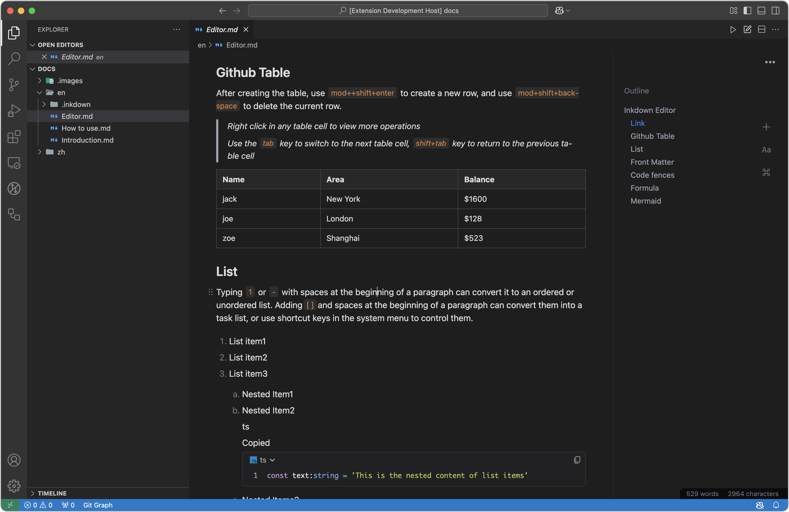

# Inkdown编辑器1

Inkdown是一个Markdown所见即所得编辑器，目标为改善Markdown编辑和阅读体验，Markdown作为通用格式非常适合存储个人数据，但是过多的符号导致它并不擅长长文本记录和阅读。Inkdown希望保持现代编辑器体验，与Markdown的通用性，并提供最简单高效的文档共享能力。2

| VsCode                                                                         | Mac                                                                                                                                                                                 | Windows                                                                                                                                                                               | Linux                                                          |
| ------------------------------------------------------------------------------ | ----------------------------------------------------------------------------------------------------------------------------------------------------------------------------------- | ------------------------------------------------------------------------------------------------------------------------------------------------------------------------------------- | -------------------------------------------------------------- |
| [Market](https://marketplace.visualstudio.com/items?itemName=1943time.inkdown) | [Arm64](https://github.com/1943time/inkdown/releases/latest/download/Inkdown-mac-arm64.dmg) [X64](https://github.com/1943time/inkdown/releases/latest/download/Inkdown-mac-x64.dmg) | [Arm64](https://github.com/1943time/inkdown/releases/latest/download/Inkdown-win-arm64.exe)   [X64](https://github.com/1943time/inkdown/releases/latest/download/Inkdown-win-x64.exe) | [Release](https://github.com/1943time/inkdown/releases/latest) |

桌面版


VsCode



你可以使用浮动栏中的链接选项为文本添加链接，链接可以是空间内的其他 markdown 文件，也可以是 HTTP 等协议地址。如下图所示：

> Inkdown 使用相对路径在源 markdown 文件中保存文件链接。


也可以使用 `tab`来补全文件路径，并添加 `#` 来链接到 markdown 文件的锚点


## Github Table

创建表后，使用`mod++shift+enter`创建新行，使用`mod+shif+backspace`删除当前行。

> 在任意表格单元中右键可以查看更多操作
> 
> 使用`tab`键切换到下一个表单元格，`shift+tab`键返回上一个表单元

| Name | Area     | Balance |
| ---- | -------- | ------- |
| jack | New York | $1600   |
| joe  | London   | $128    |
| zoe  | Shanghai | $523    |

## List

在段落开头键入`1`或`-`加空格可以将其转换为有序或无序列表。在段落开头添加`[]`和空格可以将它们转换为任务列表，也可以使用系统菜单中的快捷键来控制它们。

1. List item1
2. List item2
3. List item3

   1. Nested Item1
   2. Nested Item2

      ts

      Copied

      ```ts
      const text:string = 'This is the nested content of list items'
      ```

   3. Nested Items3


- Todo1
- Todo2

列表项可以与内容嵌套。使用`mod+enter`将新元素插入列表项中，并使用tab或`shift+tab`缩进或撤消列表。

## Front Matter

在文档开头输入`---`符号，然后按Enter键插入Front matter元素。Inkdown仅显示内容，无需任何特殊处理。

## Code fences

在段落开头输入以下内容，并添加一个输入以创建代码围栏

````
```[language]
````

在代码围栏的末尾，使用`mod+enter`跳出代码段或使用上下箭头键。

> 注意：在代码围栏中使用`mod+a`时，围栏中的代码将被选中，而不是整个文档。当代码围栏内容为空时，使用删除键可直接删除元素。

```ts
class Human {
	public say() { 
    console.log('hello world')
	}
}
```

```go
package main

import "fmt"

func main() {
    fmt.Println("Hello, World!")
}
```

```swift
import Cocoa
struct MarksStruct {
    var mark: Int
    init(mark: Int) {
      self.mark = mark
    }
}
var aStruct = MarksStruct(mark: 98)
print(aStruct.mark)
```

## 公式

在段落的开头键入`$$`以创建块级公式编辑区域，公式将在下面自动呈现。当光标离开编辑区域时，它将自动折叠。渲染效果如下：

$$
\int_{-\infty}^{+\infty} e^{-x^2} dx = \sqrt{\pi}
$$

行内公式:$\int_{-\infty}^{+\infty} e^{-x^2} dx = \sqrt{\pi}$

## Mermaid

Mermaid是一个使用语法渲染图形的工具。当您为Mermaid语言创建代码围栏时，Mermaid图形将在代码片段下方自动渲染，以获取[更多详细信息](https://mermaid.js.org/)。

当光标离开输入区域时，代码围栏将自动折叠，渲染效果如下：

